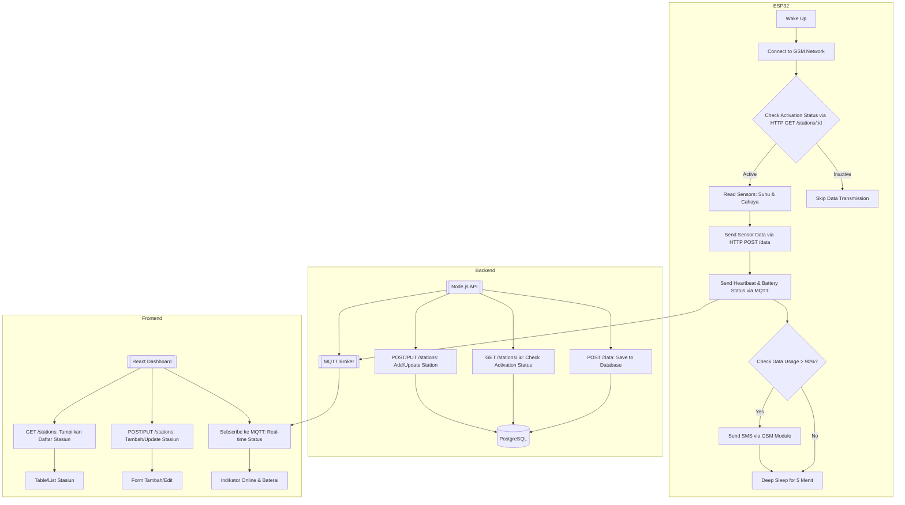

# fullstack-iot-monitoring
This is my initial version of internet of things starter kit (front-end, back-end, &amp; microcontroller code)

# Table of Contents

- [Struktur Folder](#struktur-folder)
- [Setup Instruction](#setup-instruction)
- [Flow Chart Case](#flow-chart-case)

## Struktur Folder
```
fullstack-iot-monitoring/
├── backend/                            # Node.js + Express.js API
│   ├── src/
│   │   ├── config/                     # Konfigurasi database dan env
│   │   │   └── db.js
│   │   ├── controllers/                # Logic controller
│   │   │   ├── station.controller.js
│   │   │   └── sensor.controller.js
│   │   ├── models/                     # Model Sequelize/PostgreSQL
│   │   │   ├── station.model.js
│   │   │   └── sensor.model.js
│   │   ├── routes/                     # Endpoint routes
│   │   │   ├── station.routes.js
│   │   │   └── sensor.routes.js
│   │   ├── services/                   # Business logic
│   │   │   ├── mqtt.service.js
│   │   │   └── notification.service.js
│   │   └── index.js                    # Entry point
│   ├── .env                            # Environment variables
│   ├── package.json
│   └── docker-compose.yml              # Untuk PostgreSQL & Mosquitto (opsional)
│
├── frontend/                            # React.js Dashboard
│   ├── public/
│   ├── src/
│   │   ├── components/
│   │   │   ├── Dashboard.js
│   │   │   ├── StationList.js
│   │   │   └── RealtimeStatus.js
│   │   ├── pages/
│   │   │   ├── StationsPage.js
│   │   │   └── MonitoringPage.js
│   │   ├── services/                   # API Client
│   │   │   └── api.js
│   │   ├── App.js
│   │   └── index.js
│   ├── .env
│   └── package.json
│
├── esp32-code/                          # Kode ESP32
│   ├── lib/
│   │   ├── GSMHandler/                  # Modul GSM (SIM800L/7600)
│   │   └── MQTTClient/                  # Library MQTT
│   ├── src/
│   │   ├── main.cpp                     # Main program
│   │   ├── http_client.cpp              # HTTP logic
│   │   └── power_manager.cpp            # Deep sleep & battery
│   └── platformio.ini                   # Konfigurasi PlatformIO
│
├── database/                            # SQL scripts
│   ├── migrations/
│   └── seeders/
│
└── docs/                                # Dokumentasi
    └── hardware-setup.md                # Diagram koneksi sensor
```

### 1. Backend Template Code
example of `station.controller.js`
```javascript
const db = require("../models");
const Station = db.stations;

// Create Station
exports.create = async (req, res) => {
  try {
    const station = await Station.create({
      name: req.body.name,
      location: req.body.location,
      is_active: req.body.is_active || true
    });
    res.status(201).json(station);
  } catch (error) {
    res.status(500).json({ message: error.message });
  }
};

// Update Station Status
exports.updateStatus = async (req, res) => {
  try {
    const station = await Station.update(
      { is_active: req.body.is_active },
      { where: { id: req.params.id } }
    );
    res.json({ message: "Status updated!" });
  } catch (error) {
    res.status(500).json({ message: error.message });
  }
};
```
example of `sensor.routes.js`
```javascript
const express = require("express");
const router = express.Router();
const sensorController = require("../controllers/sensor.controller");

// ESP32 mengirim data sensor ke endpoint ini
router.post("/data", sensorController.create);
router.get("/stations/:id", sensorController.getStationStatus);

module.exports = router;
```
### 2. ESP32 Template Code
example of `main.cpp`
```cpp
#include <Arduino.h>
#include <HTTPClient.h>
#include "GSMHandler.h"
#include "power_manager.h"

// Konfigurasi
#define API_URL "http://your-api.com/api/stations/1"
#define MQTT_BROKER "mqtt://broker.hivemq.com"

GSMHandler gsm;
PowerManager power;

void setup() {
  Serial.begin(115200);
  gsm.connect("APN", "USER", "PASS");  // Ganti dengan APN provider
  power.begin();
}

void loop() {
  // 1. Cek status stasiun via HTTP
  if (gsm.isConnected()) {
    String status = httpGet(API_URL);
    if (status == "active") {
      // 2. Baca sensor dan kirim data
      float temp = readTemperature();
      float light = readLight();
      httpPost("/api/data", {"temp": temp, "light": light});
      
      // 3. Cek kuota
      if (gsm.getDataUsage() > 90%) {
        gsm.sendSMS("+628xxx", "Kuota hampir habis!");
      }
    }
  }
  
  // 4. Mode hemat daya
  power.deepSleep(5 * 60 * 1000000); // Tidur 5 menit
}
```
### 3. Frontend Template Code
example of `StationList.js`
```javascript
import React, { useEffect, useState } from 'react';
import { Table, Button, Switch } from 'antd';
import api from '../services/api';

const StationList = () => {
  const [stations, setStations] = useState([]);

  useEffect(() => {
    api.get('/stations').then(res => setStations(res.data));
  }, []);

  const toggleStatus = async (id, checked) => {
    await api.put(`/stations/${id}`, { is_active: checked });
    setStations(stations.map(station => 
      station.id === id ? { ...station, is_active: checked } : station
    ));
  };

  const columns = [
    { title: 'Nama', dataIndex: 'name' },
    { title: 'Lokasi', dataIndex: 'location' },
    { 
      title: 'Status', 
      render: (_, record) => (
        <Switch 
          checked={record.is_active} 
          onChange={(checked) => toggleStatus(record.id, checked)}
        />
      )
    }
  ];

  return <Table dataSource={stations} columns={columns} />;
};

export default StationList;
```
### 4. Database Schema
```sql
-- stations table
CREATE TABLE stations (
  id SERIAL PRIMARY KEY,
  name VARCHAR(255) NOT NULL,
  location VARCHAR(255),
  is_active BOOLEAN DEFAULT true,
  created_at TIMESTAMP DEFAULT NOW()
);

-- sensor_data table
CREATE TABLE sensor_data (
  id SERIAL PRIMARY KEY,
  station_id INTEGER REFERENCES stations(id),
  temperature FLOAT,
  light INT,
  timestamp TIMESTAMP DEFAULT NOW()
);
```

## Setup Instruction
### 1. Backend:
```bash
cd backend
npm install express sequelize pg mqtt
cp .env.example .env  # Isi variabel database
npm start
```
### 2. Frontend:
```bash
cd frontend
npm install axios antd @mui/material mqtt
npm start
```
### ESP32
- Gunakan PlatformIO/VSCode
- Install library:
  - `HTTPClient`
  - `PubSubClient` (untuk MQTT)
  - `TinyGSM` (untuk modem GSM)
## Tambahan
- Untuk notifikasi kuota via SMS, gunakan library `TinyGSM` di ESP32.
- Untuk real-time status, gunakan kombinasi:
    - ESP32 publish status ke `esp32/status` via MQTT
    - Dashboard subscribe ke topik yang sama menggunakan `MQTT.js`
```javascript
// RealtimeStatus.js (React)
import mqtt from 'mqtt';

const RealtimeStatus = ({ stationId }) => {
  const [isOnline, setIsOnline] = useState(false);

  useEffect(() => {
    const client = mqtt.connect('ws://mqtt-broker-url');
    client.subscribe(`esp32/${stationId}/status`);
    client.on('message', (topic, message) => {
      setIsOnline(message.toString() === 'online');
    });
    return () => client.end();
  }, []);

  return <Tag color={isOnline ? 'green' : 'red'}>{isOnline ? 'Online' : 'Offline'}</Tag>;
};
```

## Flow Chart Case
Berikut flowchart/alur kerja sistem monitoring IoT sederhana:

### Penjelasan
### 1. ESP32
- Wake Up: Bangun dari mode deep sleep.
- Connect to GSM: Menggunakan kartu prabayar untuk koneksi internet.
- Check Activation: HTTP GET ke /stations/:id untuk memastikan stasiun aktif.
- Read Sensors: Baca data sensor jika status aktif.
- Send Data: POST data sensor ke endpoint /data.
- Send MQTT Status: Publish status baterai dan "online" ke topik MQTT (e.g., esp32/{id}/status).
- Check Quota: Hitung penggunaan kuota dan kirim SMS jika kuota <10%.
- Deep Sleep: Tidur untuk hemat daya.

### 2. Backend
- POST /data: Simpan data sensor ke database.
- GET /stations/:id : Cek status aktivasi stasiun.
- POST/PUT /stations: Kelola stasiun (tambah/update).
- MQTT Broker: Terima status dari ESP32 dan broadcast ke frontend.

### 3. Frontend
- GET /stations: Tampilkan daftar stasiun dengan statusnya.
- POST/PUT /stations: Form untuk manajemen stasiun.
- Subscribe MQTT: Tampilkan indikator real-time (online/baterai).

### 4. Database
- Stations Table: Simpan info stasiun (`id`, `name`, `location`, `is_active`).
- Sensor Data Table: Simpan data sensor (`station_id`, `temperature`, `light`, `timestamp`).

### Pseudocode
### 1. ESP32 Data Transmission:
```plaintext
WHILE TRUE:
    WAKE_UP()
    CONNECT_GSM()
    status = HTTP_GET("/api/stations/{device_id}")
    IF status == "active":
        temperature = READ_TEMP_SENSOR()
        light = READ_LIGHT_SENSOR()
        HTTP_POST("/api/data", {temperature, light})
        MQTT_PUBLISH("esp32/{device_id}/status", "online")
        MQTT_PUBLISH("esp32/{device_id}/battery", battery_level)
        IF DATA_USAGE > 90%:
            GSM_SEND_SMS("Kuota hampir habis!")
    ELSE:
        MQTT_PUBLISH("esp32/{device_id}/status", "offline")
    DEEP_SLEEP(5 minutes)
```
### 2. Backend API:
```plaintext
ENDPOINT POST /api/data:
    VALIDATE_REQUEST()
    SAVE_TO_DB(station_id, temperature, light)
    RETURN 200 OK

ENDPOINT GET /api/stations/{id}:
    QUERY_DB("SELECT is_active FROM stations WHERE id = {id}")
    IF found:
        RETURN {is_active: true/false}
    ELSE:
        RETURN 404 Not Found

ENDPOINT POST /api/stations:
    CREATE_STATION(name, location, is_active)
    RETURN 201 Created
```
### 3. Frontend Dashboard:
```plaintext
ONLOAD:
    FETCH("/api/stations") → Display stations

ON_FORM_SUBMIT:
    IF new_station:
        POST("/api/stations", {name, location, is_active})
    ELSE:
        PUT("/api/stations/{id}", {is_active})

SUBSCRIBE_MQTT("esp32/+/status"):
    IF message == "online":
        UPDATE_UI(indicator → green)
    ELSE:
        UPDATE_UI(indicator → red)
```
